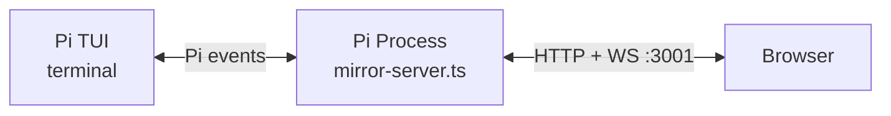

# AGENTS.md

## Policies & Mandatory Rules

### `latestCtx` — Never capture `ctx` in long-lived closures

The Pi extension runner **invalidates** `ExtensionContext` after session replacement, fork, switch, or reload. Any closure that captures a `ctx` parameter and uses it after one of those operations will throw:

> This extension ctx is stale after session replacement or reload. Do not use a captured pi or command ctx after ctx.newSession(), ctx.fork(), ctx.switchSession(), or ctx.reload().

**Rule**: `extensions/mirror-server.ts` uses a module-level `latestCtx` variable. Every Pi event callback updates it with the fresh `ctx`.

**All code that may run after a session lifecycle event** — WebSocket `close`/`error`/`connection` handlers, `setInterval` timers, async callbacks from external sources — must use `latestCtx`, never a captured `ctx` parameter.

The same stale-context rule applies to `latestExecuteCtx` (`ExtensionCommandContext`, captured via `/webui`, adds `navigateTree()`, `fork()`, and other session-control methods). 
After session replacement, any captured `ExtensionCommandContext` becomes stale and must be re-captured via `/webui`.

### Extension output — `ctx.ui.setStatus` / `ctx.ui.notify` only

Per `docs/adr/0001-pi-extension-output-policy.md`: never write to `stdout`/`stderr` from extension code. Use `ctx.ui.setStatus(...)` for persistent state and `ctx.ui.notify(...)` for one-shot user messages. Use `latestCtx`, not a captured `ctx`.

### Event forwarding — thin transport

Per `docs/adr/0002-web-ui-extension-event-protocol.md`: Mirror Server forwards events unchanged. Never interpret extension payloads into Pi Web UI product concepts inside the extension. The browser owns feature interpretation.

### Mandatory Skill Usage

#### `$webui-visual-check`

Run `$webui-visual-check` after UI, WebSocket-driven visible state, session tree/sidebar, Workspace Status Float, Right Panel, mobile sheet, or artifact display changes where DOM-only checks can miss visible regressions. Skip for docs-only changes unless the docs change this skill or visual validation requirements. This skill is visual validation, not E2E.

## Project Structure Guide

### Repo Structure & Important Files

```
.
├── docs/
│   ├── adr/                     # Architecture Decision Records (必读)
│   │   ├── 0001-pi-extension-output-policy.md          # Extension output rules (no stdout/stderr)
│   │   ├── 0002-web-ui-extension-event-protocol.md     # Web UI event forwarding protocol
│   │   ├── 0003-navigate-tree-via-captured-command-context.md # latestCtx vs latestExecuteCtx workaround
│   │   ├── 0004-web-ui-access-bind-address.md          # Server bind address policy
│   │   ├── 0005-intercepted-command-ui-lifecycle.md    # Intercepted command UI state handling
│   │   ├── 0006-project-scope-single-session-web-ui.md # Single-session scope definition
│   │   ├── 0007-npm-publish-distribution-strategy.md   # npm publish + dist/ strategy
│   │   ├── 0008-unified-websocket-protocol.md          # WebSocket req/res/event protocol
│   │   ├── 0009-frontend-state-management-hybrid-zustand.md # Zustand + local state hybrid
│   │   ├── 0010-real-pi-web-ui-e2e.md                  # Real Pi agent Web UI E2E tests
│   │   └── 0011-web-ui-visual-validation.md            # Browser screenshot visual validation
│   ├── prd/                     # Product Requirement Documents (功能设计)
│   │   ├── arch-mode-ui.md          # Architecture mode toggle UI
│   │   ├── tree-sidebar.md          # Conversation tree sidebar
│   │   ├── columns-layout.md        # Multi-column layout design
│   │   ├── branch-message.md        # Branch from user messages
│   │   ├── left-sidebar.md          # Left sidebar design
│   │   ├── right-panel.md           # Tabbed right panel design
│   │   ├── workspace-artifacts.md   # Markdown artifact detection/display
│   │   └── workspace-status-float.md # Git status + artifacts floating indicator
│   └── images/                  # Screenshots for README
├── extensions/
│   ├── mirror-server.ts         # Main extension: HTTP + WS server + all event handling
│   └── imessage-bridge.ts       # iMessage integration extension
├── e2e/                         # Real Pi agent E2E tests
│   ├── features/                # Playwright-BDD feature files
│   ├── steps/                   # Step definitions
│   ├── fixtures/                # Faux provider extension and response fixtures
│   └── harness/                 # pi --mode rpc process/session launcher
├── src/web/                     # React frontend source
│   ├── index.html               # Vite entry HTML
│   ├── index.css                # Global styles (Tailwind)
│   ├── src/
│   │   ├── main.tsx             # React entry point
│   │   ├── app.tsx              # Root layout + local UI state
│   │   ├── core/
│   │   │   ├── pi-client.ts     # WebSocket transport, reconnect, req/res queue
│   │   │   ├── ws.ts            # WebSocket URL helper
│   │   │   ├── types.ts         # TypeScript types for WebSocket protocol
│   │   │   ├── chat-conversion.ts # Converts raw events → UI message models
│   │   │   ├── format.ts        # Display formatting utilities
│   │   │   ├── workspace-artifacts.ts # Markdown artifact recovery from tool events/session entries
│   │   │   ├── tool-summary.ts  # Tool call summary rendering
│   │   │   ├── constants.ts     # Shared constants
│   │   │   └── store/           # Zustand slices + event dispatcher
│   │   └── components/
│   │       ├── pi-web-ui/       # Pi Web UI components
│   │       │   ├── chat-item-view.tsx    # Main chat message renderer
│   │       │   ├── conversation-sidebar.tsx     # Session tree sidebar
│   │       │   ├── conversation-sidebar-tree.tsx # Tree view component
│   │       │   ├── command-palette.tsx   # Command palette
│   │       │   ├── model-picker.tsx
│   │       │   ├── settings-panel.tsx
│   │       │   ├── context-popover.tsx
│   │       │   ├── right-panel.tsx
│   │       │   ├── workspace-status-float.tsx
│   │       │   ├── user-message-view.tsx # User message with Branch button
│   │       │   └── ...
│   ├── components/
│   │   ├── ai-elements/         # AI Elements components (conversation, message, tool, reasoning, etc.)
│   │   └── ui/                  # shadcn/ui primitives (button, dialog, input, etc.)
│   └── lib/
│       └── utils.ts             # shadcn/ui utility (cn helper)
├── public/                      # Static assets copied by Vite (icons, manifest, sw.js)
├── dist/                        # Vite build output (gitignored)

├── MOBILE.md                    # Mobile access guide
├── RELEASING.md                 # npm publish and pi.dev verification checklist

├── package.json                 # npm package config + pi extension manifest
├── tsconfig.json                # TypeScript config (only src/web + vite.config.ts)
├── vite.config.ts               # Vite config (dev proxy to :3001, build to dist/)
├── biome.json                   # Biome formatter/linter config
└── justfile                     # just tasks (fmt, check)
```

### Architecture: Extension ↔ Frontend Communication



- **Extension (`mirror-server.ts`)**: subscribes to Pi events via `pi.on(...)`, forwards them to browser WebSocket clients. Accepts commands from browser, executes via extension API.
- **Frontend (`src/web/`)**: React + Vite + Tailwind. `PiClient` connects to the extension WebSocket, `event-dispatch.ts` routes raw events into Zustand slices, and React components render store state.
- **Dev proxy**: `vite dev` on `:4444` proxies `/api` → `:3001` and `/ws` → `ws://localhost:3001`.

#### Event envelope

All WebSocket messages to the browser use:

```json
{ "type": "event", "event": "<event-name>", "payload": { "...": "..." } }
```

Pi core events carry their native fields inside `payload`. Extension-bus events keep their source payload nested under `payload` when needed to avoid field collisions.

#### State snapshot on connect

When a browser WebSocket connects, `buildStateSnapshot(latestCtx)` sends full session state (messages, model, session info, tool calls). After that, incremental events keep the UI in sync.

#### Commands from browser → extension

Browser sends JSON commands over WebSocket. Commands invoke Pi extension API methods (send message, cancel, set model, etc.) through `latestCtx`/`latestExecuteCtx`.

## Operation Guide

### Development Workflow

#### Frontend development

Run Pi with Pi Web UI on its normal port in one terminal, then:

```bash
npm run dev:web
```

Open `http://localhost:4444`. Vite serves the React UI and proxies `/api` and `/ws` to the Pi Web UI extension on `localhost:3001`.

#### Build for production

```bash
npm run build:web
```

Output goes to `dist/`. Then run Pi with the built assets:

```bash
PI_WEB_UI_STATIC_DIR=$(pwd)/dist pi
```

### Testing & Checks

Testing has three layers:

| Layer | Purpose | Includes Pi agent? | Primary tool |
|-------|---------|--------------------|--------------|
| Check | Fast local static/build validation | No | `just check`, `npm run build:web` |
| E2E | Validate the real Pi Web UI product path | Yes | Playwright-BDD + `pi --mode rpc` + faux provider |
| Visual validation | Inspect rendered UI for visible layout defects | Optional | Browser screenshots via `$webui-visual-check` |

E2E means the test includes the real Pi product path:

```text
Playwright Browser
  -> Pi mirror-server static UI + /ws
  -> pi --mode rpc
  -> Pi agent session
  -> faux LLM provider
  -> real tools / real temp workspace / real git
```

E2E rules:

- Put E2E tests under `e2e/`.
- Use Playwright-BDD feature files for product-level flows.
- Start a real `pi --mode rpc` process for each scenario.
- Load the local `extensions/mirror-server.ts` extension normally.
- Use built `dist` assets served by mirror-server in CI.
- Use a faux LLM provider only to make model responses deterministic.
- Use real Pi `write` / `edit` tools when testing Markdown artifacts.
- Use real git repositories in temp workspaces when testing git status or diff.
- Do not mock `/ws`, set React state directly, or call component props in E2E.

Run the real Pi E2E suite with:

```bash
npm run e2e
```

Regenerate Playwright tests from feature files without running the browser with:

```bash
npm run e2e:gen
```

GitHub Actions runs E2E on every PR after `npm run build:web`. Local default checks do not run E2E unless the developer explicitly invokes the E2E command or is changing E2E harness/tests.

Visual validation checks what the user can actually see. Run `$webui-visual-check` after UI, WebSocket-driven visible state, session tree/sidebar, Workspace Status Float, Right Panel, mobile sheet, or artifact display changes where DOM-only checks can miss visual regressions. It may inspect a real E2E-created state, a real local Pi session, or a future frontend visual harness. A frontend-only visual harness is not E2E.

Run before committing:

```bash
just check
```

This runs `npx tsc --noEmit` and then `npm run check` (`biome check .`). To format only:

```bash
just fmt
```

To lint only:

```bash
npm run lint
```

### Publishing

For npm releases, read and follow `RELEASING.md` before changing package release metadata or running publish commands.

```bash
npm pack --dry-run --json
```

### Key Files to Update Together

When adding a new WebSocket event type from the extension to the browser:

1. `extensions/mirror-server.ts` — emit the event
2. `src/web/src/core/types.ts` — add the TypeScript type
3. `src/web/src/core/store/event-dispatch.ts` — route the event to a store action
4. Relevant `src/web/src/core/store/*-slice.ts` file — update domain state
5. `src/web/src/core/chat-conversion.ts` — add conversion logic if it affects chat display
6. Corresponding React component in `src/web/src/components/pi-web-ui/`

When adding a new browser → extension command:

1. `extensions/mirror-server.ts` — add the command handler (use `latestCtx`)
2. `src/web/src/core/types.ts` — add the request/response type
3. `src/web/src/core/store/*-slice.ts` — add an intent-level store action that calls `send(...)`
4. React components — call the store action instead of invoking transport directly

When changing Workspace Status Float, Right Panel, or Artifacts:

1. `docs/prd/workspace-status-float.md` — update floating summary and entry behavior
2. `docs/prd/right-panel.md` — update tab, toggle, and panel lifecycle behavior
3. `docs/prd/workspace-artifacts.md` — update Markdown artifact source and display rules
4. `docs/adr/0008-unified-websocket-protocol.md` — update WebSocket methods if data access changes
5. `src/web/src/core/store/workspace-slice.ts` and `src/web/src/core/store/right-panel-slice.ts` — update shared state and tab lifecycle
6. `src/web/src/components/pi-web-ui/workspace-status-float.tsx` and related right-panel components — keep UI behavior aligned with the PRDs

When changing real Pi E2E behavior:

1. `docs/adr/0010-real-pi-web-ui-e2e.md` — update process, fixtures, or scope decisions
2. `e2e/features/*.feature` — update product-level scenarios
3. `e2e/steps/*.ts` — update Playwright-BDD steps
4. `e2e/harness/*.ts` and `e2e/fixtures/**` — update Pi launch, temp workspace, or faux provider behavior
5. `.github/workflows/ci.yml` and `package.json` — keep CI and local commands aligned

### Reference

- Pi RPC docs: `/opt/homebrew/lib/node_modules/@mariozechner/pi-coding-agent/docs/rpc.md`
- Pi SDK docs: `/opt/homebrew/lib/node_modules/@mariozechner/pi-coding-agent/docs/sdk.md`
- Pi JSON mode: `/opt/homebrew/lib/node_modules/@mariozechner/pi-coding-agent/docs/json.md`
- Pi session docs: `/opt/homebrew/lib/node_modules/@mariozechner/pi-coding-agent/docs/session.md`
