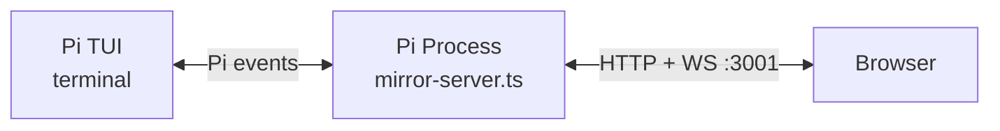

# AGENTS.md

Pi extension that mirrors the terminal session in the browser — WebSocket + HTTP server inside Pi, React frontend.

**Location:** `AGENTS.md` at the repository root.

## Table of Contents

1. [Policies & Mandatory Rules](#policies--mandatory-rules)
2. [Project Structure Guide](#project-structure-guide)
3. [Operation Guide](#operation-guide)

## Policies & Mandatory Rules

### `latestCtx` — Never capture `ctx` in long-lived closures

The Pi extension runner **invalidates** `ExtensionContext` after session replacement, fork, switch, or reload. Any closure that captures a `ctx` parameter and uses it after one of those operations will throw:

> This extension ctx is stale after session replacement or reload. Do not use a captured pi or command ctx after ctx.newSession(), ctx.fork(), ctx.switchSession(), or ctx.reload().

**Rule**: `extensions/mirror-server.ts` uses a module-level `latestCtx` variable. Every Pi event callback updates it with the fresh `ctx`.

**All code that may run after a session lifecycle event** — WebSocket `close`/`error`/`connection` handlers, `setInterval` timers, async callbacks from external sources — must use `latestCtx`, never a captured `ctx` parameter.

The same stale-context rule applies to `latestExecuteCtx` (`ExtensionCommandContext`, captured via `/webui`, adds `navigateTree()`, `fork()`, and other session-control methods). 
After session replacement, any captured `ExtensionCommandContext` becomes stale and must be re-captured via `/webui`.

### Extension output — `ctx.ui.setStatus` / `ctx.ui.notify` only

Per `adrs/0001-pi-extension-output-policy.md`: never write to `stdout`/`stderr` from extension code. Use `ctx.ui.setStatus(...)` for persistent state and `ctx.ui.notify(...)` for one-shot user messages. Use `latestCtx`, not a captured `ctx`.

### Event forwarding — thin transport

Per `adrs/0002-web-ui-extension-event-protocol.md`: Mirror Server forwards events unchanged. Never interpret extension payloads into Pi Web UI product concepts inside the extension. The browser owns feature interpretation.

### Mandatory Skill Usage

#### `$webui-e2e` 

Real integration + visual validation workflow. Use after UI/WebSocket/session-tree changes where DOM-only checks can miss visible regressions.

## Project Structure Guide

### Repo Structure & Important Files

```
.
├── adrs/                        # Architecture Decision Records (必读)
│   ├── 0001-pi-extension-output-policy.md          # Extension output rules (no stdout/stderr)
│   ├── 0002-web-ui-extension-event-protocol.md     # Web UI event forwarding protocol
│   ├── 0003-navigate-tree-via-captured-command-context.md # latestCtx vs latestExecuteCtx workaround
│   ├── 0004-web-ui-access-bind-address.md          # Server bind address policy
│   ├── 0005-intercepted-command-ui-lifecycle.md    # Intercepted command UI state handling
│   ├── 0006-project-scope-single-session-web-ui.md # Single-session scope definition
│   ├── 0007-npm-publish-distribution-strategy.md   # npm publish + dist/ strategy
│   ├── 0008-unified-websocket-protocol.md          # WebSocket req/res/event protocol
│   └── 0009-frontend-state-management-hybrid-zustand.md # Zustand + local state hybrid
├── prds/                        # Product Requirement Documents (功能设计)
│   ├── arch-mode-ui.md          # Architecture mode toggle UI
│   ├── tree-sidebar.md          # Conversation tree sidebar
│   ├── columns-layout.md        # Multi-column layout design
│   ├── branch-message.md        # Branch from user messages
│   ├── left-sidebar.md          # Left sidebar design
│   ├── subagent-integration.md  # Sub-agent status display
│   └── workspace-status-float.md # Workspace status floating indicator
├── extensions/
│   ├── mirror-server.ts         # Main extension: HTTP + WS server + all event handling
│   └── imessage-bridge.ts       # iMessage integration extension
├── src/web/                     # React frontend source
│   ├── index.html               # Vite entry HTML
│   ├── index.css                # Global styles (Tailwind)
│   ├── src/
│   │   ├── main.tsx             # React entry point
│   │   ├── app.tsx              # Root App component
│   │   ├── core/
│   │   │   ├── ws.ts            # WebSocket client for browser ↔ extension
│   │   │   ├── types.ts         # TypeScript types for WebSocket protocol
│   │   │   ├── chat-conversion.ts # Converts raw events → UI message models
│   │   │   ├── format.ts        # Display formatting utilities
│   │   │   ├── subagents.ts     # Sub-agent data handling
│   │   │   ├── tool-summary.ts  # Tool call summary rendering
│   │   │   └── constants.ts     # Shared constants
│   │   └── components/
│   │       ├── pi-web-ui/       # Pi Web UI components
│   │       │   ├── chat-item-view.tsx    # Main chat message renderer
│   │       │   ├── conversation-sidebar.tsx     # Session tree sidebar
│   │       │   ├── conversation-sidebar-tree.tsx # Tree view component
│   │       │   ├── command-palette.tsx   # Command palette
│   │       │   ├── subagent-detail-sidebar.tsx
│   │       │   ├── model-picker.tsx
│   │       │   ├── settings-panel.tsx
│   │       │   ├── context-popover.tsx
│   │       │   ├── workspace-status-float.tsx
│   │       │   ├── user-message-view.tsx # User message with Branch button
│   │       │   └── ...
│   │       ├── ai-elements/     # AI Elements components (conversation, message, tool, reasoning, etc.)
│   │       └── ui/              # shadcn/ui primitives (button, dialog, input, etc.)
│   └── lib/
│       └── utils.ts             # shadcn/ui utility (cn helper)
├── public/                      # Static assets copied by Vite (icons, manifest, sw.js)
├── dist/                        # Vite build output (gitignored)
├── docs/images/                 # Screenshots for README
├── MOBILE.md                    # Mobile access guide
├── RELEASING.md                 # npm publish and pi.dev verification checklist

├── package.json                 # npm package config + pi extension manifest
├── tsconfig.json                # TypeScript config (only src/web + vite.config.ts)
├── vite.config.ts               # Vite config (dev proxy to :3001, build to dist/)
├── biome.json                   # Biome formatter/linter config
└── justfile                     # just tasks (fmt, check)
```

### Architecture: Extension ↔ Frontend Communication



- **Extension (`mirror-server.ts`)**: subscribes to Pi events via `pi.on(...)`, forwards them to browser WebSocket clients. Accepts commands from browser, executes via extension API.
- **Frontend (`src/web/`)**: React + Vite + Tailwind. Connects to extension via WebSocket. Converts raw events to UI models in `chat-conversion.ts`.
- **Dev proxy**: `vite dev` on `:4444` proxies `/api` → `:3001` and `/ws` → `ws://localhost:3001`.

#### Event envelope

All WebSocket messages to the browser use:

```json
{ "type": "event", "event": { "type": "<event-name>", ... } }
```

Pi core events carry their native fields. Extension-bus events nest under `event.payload`.

#### State snapshot on connect

When a browser WebSocket connects, `buildStateSnapshot(latestCtx)` sends full session state (messages, model, session info, tool calls). After that, incremental events keep the UI in sync.

#### Commands from browser → extension

Browser sends JSON commands over WebSocket. Commands invoke Pi extension API methods (send message, cancel, set model, etc.) through `latestCtx`/`latestExecuteCtx`.

## Operation Guide

### Development Workflow

#### Frontend development

Run Pi with Pi Web UI on its normal port in one terminal, then:

```bash
npm run dev:web
```

Open `http://localhost:4444`. Vite serves the React UI and proxies `/api` and `/ws` to the Pi Web UI extension on `localhost:3001`.

#### Build for production

```bash
npm run build:web
```

Output goes to `dist/`. Then run Pi with the built assets:

```bash
PI_WEB_UI_STATIC_DIR=$(pwd)/dist pi
```

### Testing & Checks

Run before committing:

```bash
just check
```

This runs `biome check .` (format + lint). To format only:

```bash
just fmt
```

To lint only:

```bash
npm run lint
```

### Publishing

For npm releases, read and follow `RELEASING.md` before changing package release metadata or running publish commands.

```bash
npm pack --dry-run --json
```

### Key Files to Update Together

When adding a new WebSocket event type from the extension to the browser:

1. `extensions/mirror-server.ts` — emit the event
2. `src/web/src/core/types.ts` — add the TypeScript type
3. `src/web/src/core/chat-conversion.ts` — add conversion logic if it affects chat display
4. Corresponding React component in `src/web/src/components/pi-web-ui/`

When adding a new browser → extension command:

1. `src/web/src/core/ws.ts` — add the send function
2. `extensions/mirror-server.ts` — add the command handler (use `latestCtx`)
3. `src/web/src/core/types.ts` — add the type

### Reference

- Pi RPC docs: `/opt/homebrew/lib/node_modules/@mariozechner/pi-coding-agent/docs/rpc.md`
- Pi SDK docs: `/opt/homebrew/lib/node_modules/@mariozechner/pi-coding-agent/docs/sdk.md`
- Pi JSON mode: `/opt/homebrew/lib/node_modules/@mariozechner/pi-coding-agent/docs/json.md`
- Pi session docs: `/opt/homebrew/lib/node_modules/@mariozechner/pi-coding-agent/docs/session.md`
