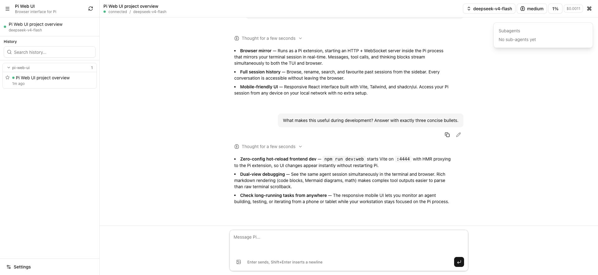
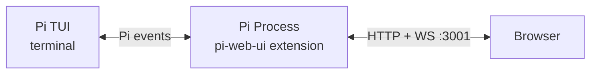

# Pi Web UI

A web UI for [Pi](https://github.com/badlogic/pi-mono) coding agent. Runs as a Pi extension inside your existing Pi process — no separate server needed.

> **Forked from [deflating/tau](https://github.com/deflating/tau).** Thanks to the original author for building the foundation.
> Renamed to pi-web-ui with significant changes including single-session scope, removed auth, redesigned sidebar.

## What it does

Pi Web UI connects to your running Pi session and gives you a browser interface. Same session, same messages, same tools — just a different screen. Type in the terminal or the browser, both stay in sync.



- **Real-time streaming** — messages, tool calls, and thinking blocks
- **Conversation tree sidebar** — inspect the current session tree, select nodes without changing drafts, branch from user messages, and continue from branch ends
- **React UI** — Vite, Tailwind, shadcn/ui, AI Elements
- **Markdown rendering** — Streamdown for code blocks, math, Mermaid
- **No extra process** — the Pi extension *is* the server

## Install

Install from GitHub:

```bash
pi install git:github.com/kkkiio/pi-web-ui
```

Or from npm:

```bash
pi install npm:@kkkiio/pi-web-ui
```

## Usage

1. Start Pi in your terminal
2. Type `/webui` — the extension uses the execution context to resolve the URL, enable advanced features, and open the browser

The server starts automatically when a Pi session begins and shuts down when the session ends.

## Features

### Chat
- Streaming text and thinking/reasoning blocks
- Tool call display with expand/collapse
- Image attachments with paste, drop, and preview
- Branch from user messages and continue from branch ends via `navigate_tree` in the current session tree (requires `/webui` command context)
- Follow-up messages while the agent is streaming

### Model & Thinking
- Current model label and searchable model picker
- Thinking level cycle button
- Context-window visualization and compact suggestion

### Sessions
- Sidebar with the current conversation tree
- Search, expand/collapse, and select tree nodes without overwriting the input draft
- Branch from user messages when you want to edit an earlier prompt and continue in the same session
- Continue from non-user branch ends when you want to resume an existing branch without changing the draft

### Commands & Settings
- Command palette: compact, export HTML, session stats, tool toggle
- Light, dark, and system theme modes

## Configuration

Environment variables (set before starting Pi):

| Variable | Default | Description |
|----------|---------|-------------|
| `PI_WEB_UI_PORT` | `3001` | Server port |
| `PI_WEB_UI_HOST` | `127.0.0.1` | Bind address |
| `PI_WEB_UI_DISABLED` | `0` | Set to `1` to disable |
| `PI_WEB_UI_STATIC_DIR` | *(bundled)* | Override static files path |
| `PI_CODING_AGENT_DIR` | `~/.pi/agent` | Override Pi config directory |
| `PI_CODING_AGENT_SESSION_DIR` | *(derived)* | Override Pi session storage directory |

Or in `~/.pi/agent/settings.json`:

```json
{
  "pi-web-ui": {
    "port": 3001,
    "host": "127.0.0.1"
  }
}
```

Pi Web UI follows Pi's `PI_CODING_AGENT_DIR` and `PI_CODING_AGENT_SESSION_DIR`
overrides when reading settings and current session state.

### Start / Stop

```
/webui-stop     Stop the server
/webui-start    Start it again
```

To prevent auto-start:

```bash
PI_WEB_UI_DISABLED=1 pi
```

## Security

Pi Web UI binds to `127.0.0.1` by default — accessible only from your local machine. For remote access, use `tailscale serve` or a reverse proxy with TLS. There is no built-in authentication; it's unnecessary for local-only access and insecure over cleartext.

## How it works

Pi Web UI is a [Pi extension](https://github.com/badlogic/pi-mono#extensions). When Pi starts a session, the extension starts an HTTP + WebSocket server inside the Pi process. The extension subscribes to Pi events and forwards them to the browser. Commands from the browser execute via the extension API using the `ExtensionContext` that Pi provides.



## Development

```bash
git clone https://github.com/kkkiio/pi-web-ui.git
cd pi-web-ui
npm install
npm run build:web
PI_WEB_UI_STATIC_DIR=$(pwd)/dist pi
```

For frontend development, run Pi in one terminal, then:

```bash
npm run dev:web
```

Open `http://localhost:4444`; Vite serves the React UI and proxies `/api` and `/ws` to the extension on `localhost:3001`.

## License

MIT
